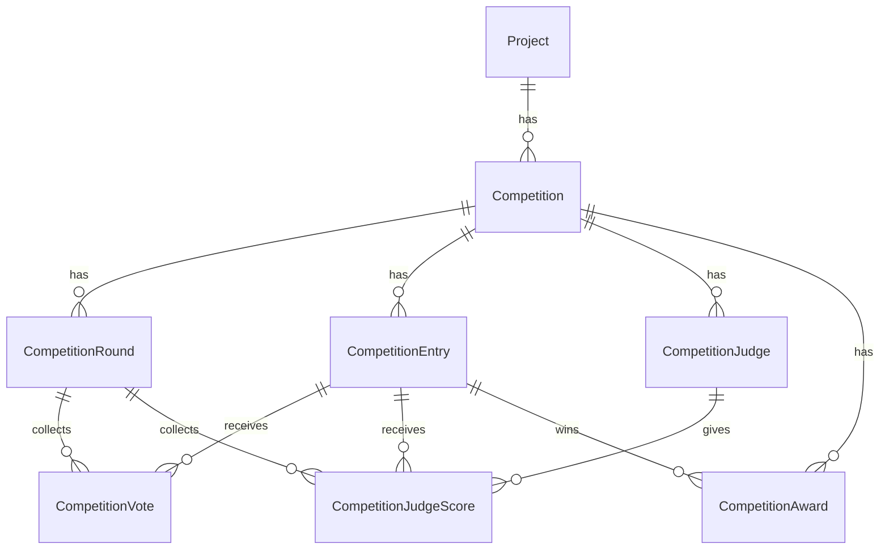

# 대회·투표 시스템 설계 (PRD / IA / ERD / Use-case)

작성일: 2026-08-13 · v1 · 상태: 설계(개발 착수 전)

## 0. 이 문서를 읽는 법

machstudio에 **"대회"를 웨비나와 같은 급의 최상위 메뉴**로 추가한다. 모집 공고 → 참가 신청 → 예선 공개투표 → 심사단 평가 → 본선 → 발표까지를 하나의 시스템으로 다룬다.

`fr.france.k-expo.org/vote` 등의 링크는 **예시일 뿐**이다. 어떤 대회에도 적용 가능해야 하며, 대회 전용 코드는 넣지 않는다. 프로젝트를 만들 때마다 "대회" 메뉴에서 새 대회를 만들고, 빌더로 구성한 뒤 **아임웹 코드블럭 한 줄**로 배포한다.

---

# 1. 배경과 목표

## 1.1 문제

대회를 열 때마다 페이지를 손으로 만든다. 모집 공고, 신청 폼, 투표 화면, 심사 화면, 집계표, 발표 화면이 전부 따로 놀고 대회마다 처음부터 다시 만든다. 집계는 스프레드시트로 하고, 투표 중복은 사실상 통제되지 않는다.

## 1.2 목표

1. **대회 하나를 빌더로 구성**한다 — 공고·신청 폼·투표 규칙·심사 기준·집계 비율·상 구성까지 코드 수정 없이.
2. **아임웹 코드블럭 한 줄**로 각 화면을 배포한다(웨비나·사전등록과 동일한 방식).
3. **미리보기 링크**로 붙이기 전에 확인한다.
4. **투표 무결성** — 한 사람이 정해진 수만큼만 투표하도록 통제한다(§9).
5. **대중 + 심사단 합산**을 설정된 비율로 자동 집계하고, 본선 진출 n팀을 자동 산출한다.
6. **발표 화면**을 여러 연출 중 골라 쓴다.

## 1.3 비목표

- 참가자 계정 시스템(회원가입) — 이탈률 때문에 명시적으로 배제
- 실시간 영상 스트리밍(웨비나가 담당)
- 상금 정산·계약 등 사무 처리

---

# 2. 범위와 단계

투표는 **대회 당일에 실패하면 되돌릴 수 없다.** 집계가 틀리면 시상 결과가 틀린다. 그래서 집계·무결성을 먼저 단단히 하고, 연출은 뒤로 뺀다.

| 단계 | 범위 | 왜 이 순서인가 |
|---|---|---|
| **C1. 대회 + 모집** | 대회 CRUD, 상세페이지 빌더, 신청 폼(팝업), 미디어 업로드, 참가작 관리·노출 토글 | 이게 없으면 아무것도 시작 못 한다 |
| **C2. 예선 투표** | 공개 투표 화면, 투표 규칙·상한, 무결성, 실시간 집계 | 대회의 심장 |
| **C3. 심사 + 본선 진출** | 심사단 초대·심사 화면, 가중 합산, 진출자 산출 | 예선 결과가 있어야 의미 |
| **C4. 본선 + 시상** | 본선 투표(현장), 최종 집계, 상 배정, 운영 대시보드 | 본선은 예선 구조 재사용 |
| **C5. 발표 연출** | 룰렛·카드공개 등 연출 모드 | **후순위** — 없어도 대회는 굴러간다 |

---

# 3. 용어

| 용어 | 뜻 | 모델 |
|---|---|---|
| 대회 | 최상위 단위. 웨비나와 같은 급 | `Competition` |
| 참가작 | 신청서 1건 = 팀/작품 1개 | `CompetitionEntry` |
| 라운드 | 예선/본선 | `CompetitionRound` |
| 대중 투표 | 일반 관람객 투표 | `CompetitionVote` |
| 심사 평가 | 심사위원이 항목별 점수 부여 | `CompetitionJudgeScore` |
| 투표자 키 | 중복 방지용 식별자(IP·기기·등록번호) | `voterKey` |
| 상 | 대상·최우수상 등 | `CompetitionAward` |

---

# 4. PRD — 기능 요구사항

## 4.1 역할

| 역할 | 하는 일 | 인증 |
|---|---|---|
| **운영자** | 대회 구성, 참가작 심사·노출, 집계 확인, 상 배정, 발표 진행 | machstudio 로그인 |
| **참가자** | 공고 열람, 신청서 제출(미디어 포함) | 없음 (이탈 방지) |
| **관람객** | 참가작 열람, 투표 | 없음 (§9로 통제) |
| **심사위원** | 배정된 참가작에 항목별 점수 | **개인 토큰 링크** (계정 없음) |

## 4.2 운영자 요구사항

**대회 구성**
- R1. 프로젝트 안에서 대회를 만든다. 이름·슬러그·기간·테마.
- R2. **모집 공고 상세페이지**를 빌더로 구성한다 — 대회 소개, 참가 자격, 신청 방법·절차, 일정, 시상 내역, FAQ. (웨비나 랜딩 빌더와 같은 결)
- R3. **신청 폼**을 빌더로 구성한다 — 항목 자유 추가, 필수/선택, 유형별 분기, 개인정보·마케팅 동의 문구 직접 입력.
- R4. 신청 폼에 **이미지·영상 첨부 항목**을 넣을 수 있다(§11).
- R5. 접수 기간을 정하면 폼이 자동으로 열리고 닫힌다. 수동 override 가능.

**참가작 관리**
- R6. 신청 목록을 보고 **개별 노출 토글**로 투표 대상에 넣고 뺀다.
- R7. 참가작 표시 순서를 정한다(수동 정렬 / 무작위 / 신청순).
- R8. 참가작 정보를 운영자가 수정할 수 있다(오타·부적절 내용).

**투표 운영**
- R9. 투표를 **on/off** 한다.
- R10. **1인당 투표 수 n개**를 정한다.
- R11. **투표자 식별 방식**을 고른다 — IP / 기기 / 등록번호(§9).
- R12. 투표 기간을 정한다.
- R13. 실시간 집계를 본다. **공개 여부를 따로 정한다**(진행 중 순위 노출은 표심을 왜곡한다).

**심사·집계**
- R14. 심사위원을 등록하고 **심사위원마다 다른 링크**를 발급한다(겹치지 않는다).
- R14a. 링크에 더해 **비밀번호**를 건다. 링크만으로는 열리지 않는다.
- R14b. **모든 심사위원이 전 참가작을 심사한다**(분할 없음 — 공평성).
- R15. **심사 항목과 배점**을 정한다(예: 창의성 30 / 완성도 40 / 시장성 30).
- R16. **대중 : 심사단 비율**을 정한다(예: 40:60).
- R17. **본선 진출 n팀**을 정하고 자동 산출한다. 동점 처리 규칙도 정한다.
- R18. 본선은 예선과 **다른 규칙**을 가질 수 있다(비율·항목·투표 방식).

**시상·발표**
- R19. 상 종류를 정하고(대상·최우수·인기상 등) 집계 결과에 배정한다.
- R20. 발표 연출을 고른다(§13).

## 4.3 관람객 요구사항

- R21. 참가작을 목록·상세로 본다(이미지·영상 재생).
- R22. 정해진 수만큼 투표한다. **몇 개 남았는지 항상 보인다.**
- R23. 이미 투표한 항목이 표시된다. **투표 취소 가능 여부는 운영자 설정.**
- R24. 투표 마감·미시작 상태를 명확히 안내받는다.

## 4.4 심사위원 요구사항

- R25. 링크만 열면 바로 심사한다(로그인 없음).
- R26. 배정된 참가작을 항목별로 채점한다. **중간 저장**된다.
- R27. 제출 전 검토하고, 제출 후에는 잠긴다(운영자가 재개 가능).

---

# 5. IA — 화면 구조

## 5.1 machstudio 내부 (운영자)

```
사이드바
├ 대시보드
├ 사전등록
├ 광고 성과
├ UTM 빌더
├ 웨비나
└ 대회            ← 신규 (웨비나와 같은 급)
   └ 대회 목록
      └ 대회 상세  ─ 탭 구조 (웨비나 상세와 같은 결)
         ├ 기본정보    이름·기간·테마·슬러그
         ├ 공고 페이지  상세페이지 빌더 + 미리보기
         ├ 신청 폼     폼 빌더(항목·동의·첨부) + 미리보기
         ├ 참가작      신청 목록·노출 토글·정렬·수정
         ├ 투표 설정    on/off·라운드·상한·식별 방식·기간
         ├ 심사단      심사위원·심사 항목·배점·링크 발급
         ├ 집계        실시간 순위·가중 합산·진출자 산출
         ├ 시상        상 정의·배정
         ├ 발표        연출 선택·리허설·송출
         └ 배포        코드블럭 스니펫·미리보기 링크
```

## 5.2 공개 화면 (아임웹 임베드 또는 호스팅)

| 화면 | 배포 방식 | 이유 |
|---|---|---|
| 모집 공고 + 신청 팝업 | **아임웹 임베드** | 기존 사이트 안에 자연스럽게 |
| 예선 투표 | **아임웹 임베드** | 트래픽이 사이트로 모여야 함 |
| 본선/현장 투표 | **아임웹 임베드** 또는 호스팅 | 현장은 QR로 여는 경우가 많음 |
| 심사 투표 | **호스팅 + 개인 토큰** | 아임웹에 노출할 이유가 없고, 토큰 관리가 안전 |
| 집계 대시보드 | machstudio 내부 (+ 선택적 공개 링크) | 운영 정보 |
| 발표 화면 | **호스팅 전체화면** | 현장 스크린 송출용 |

```
아임웹 코드블럭 (한 줄)
  <script async src=".../c/{competitionId}"></script>        모집 공고 + 신청
  <script async src=".../c/{competitionId}/vote"></script>    투표

호스팅 (machstudio)
  /j/{judgeToken}          심사 화면
  /cp/{previewToken}       미리보기
  /show/{showToken}        발표 화면 (전체화면)
```

---

# 6. ERD — 도메인 모델

## 6.1 관계도



## 6.2 Prisma 모델

**웨비나 모델을 그대로 본뜬다** — `workspaceId`+`projectId`, `slug @unique`, `theme`/`config` Json, `statusOverride`(`prisma/schema.prisma:505-552`). 검증된 구조라 새로 발명하지 않는다.

```prisma
model Competition {
  id          String   @id @default(cuid())
  workspaceId String
  projectId   String
  name        String
  slug        String   @unique
  description String?

  // 단계 — 날짜로 자동 판정 + 수동 override (resolveWebinarStatus 패턴)
  phase          String?  // null=자동 | "recruiting"|"prelim"|"judging"|"final"|"announced"|"closed"
  recruitOpenAt  DateTime?
  recruitCloseAt DateTime?

  theme       Json     // accentColor·surface·radius·logo — 웨비나 theme 계약 재사용
  config      Json     // 공고 페이지·신청 폼·동의·완료 처리
  scoringConfig Json?  // 대중:심사 비율, 진출 n팀, 동점 규칙 (§10)
  showConfig    Json?  // 발표 연출 (§13)

  previewToken String? @unique   // 미리보기 링크
  showToken    String? @unique   // 발표 화면 링크

  createdAt DateTime @default(now())
  updatedAt DateTime @updatedAt

  workspace Workspace @relation(fields: [workspaceId], references: [id], onDelete: Cascade)
  project   Project   @relation(fields: [projectId], references: [id], onDelete: Cascade)
  rounds    CompetitionRound[]
  entries   CompetitionEntry[]
  judges    CompetitionJudge[]
  awards    CompetitionAward[]

  @@index([projectId, createdAt(sort: Desc)])
  @@index([workspaceId])
}

model CompetitionRound {
  id            String   @id @default(cuid())
  competitionId String
  kind          String   // "prelim" | "final"
  name          String   // "예선 공개투표"
  sortOrder     Int      @default(0)

  // 투표 운영
  voteEnabled   Boolean  @default(false)   // 운영자 on/off — R9
  voteOpenAt    DateTime?
  voteCloseAt   DateTime?
  maxVotesPerVoter Int   @default(1)       // R10
  allowVoteUndo Boolean  @default(false)   // R23
  voterIdentity String   @default("device") // "ip"|"device"|"both"|"registration" — §9
  ipVoteLimit   Int?     // voterIdentity=device 일 때 IP 보조 상한 (§9.4)
  showLiveTally Boolean  @default(false)   // R13 — 진행 중 순위 공개(라운드별 선택)

  // 참가작 표시 순서 — 예선은 무작위(위치 편향 제거), 본선은 순서대로가 기본
  entryOrder    String   @default("random") // "random"|"manual"|"submitted"

  // 이전 라운드 점수 이월 — 기본 끔(리셋). 나중에 켤 수 있게 구조만 열어 둔다
  carryOverEnabled Boolean @default(false)
  carryOverPercent Int     @default(0)      // carryOverEnabled=true 일 때 이전 라운드 종합점수 반영 비율

  // 심사
  judgeCriteria Json?    // [{ key, label, maxScore }] — R15
  publicWeight  Int      @default(50)      // R16 (합 100)
  judgeWeight   Int      @default(50)
  advanceCount  Int?     // R17 — 이 라운드 통과 팀 수

  competition Competition @relation(fields: [competitionId], references: [id], onDelete: Cascade)
  votes       CompetitionVote[]
  judgeScores CompetitionJudgeScore[]

  @@unique([competitionId, kind])
  @@index([competitionId])
}

model CompetitionEntry {
  id            String   @id @default(cuid())
  competitionId String
  entryNo       String   // 참가번호 (표시·현장 호출용)
  title         String
  teamName      String?
  summary       String?  @db.Text
  data          Json     // 신청 폼 응답 전체 (사전등록 CollectRecord.data 와 같은 계약)
  media         Json     // [{ kind:"image"|"video", url, thumbUrl?, sortOrder }] — §11

  // 신청자 연락처 (검색·연락용으로 승격)
  contactName   String?
  contactEmail  String?
  contactPhone  String?

  status        String   @default("submitted") // submitted|approved|rejected
  isPublished   Boolean  @default(false)       // R6 — 투표 노출 토글
  sortOrder     Int      @default(0)           // R7
  advanced      Boolean  @default(false)       // 본선 진출 여부

  submittedAt DateTime @default(now())

  competition Competition @relation(fields: [competitionId], references: [id], onDelete: Cascade)
  votes       CompetitionVote[]
  judgeScores CompetitionJudgeScore[]
  awards      CompetitionAward[]

  @@unique([competitionId, entryNo])
  @@index([competitionId, isPublished, sortOrder])
}

model CompetitionVote {
  id       String   @id @default(cuid())
  roundId  String
  entryId  String
  voterKey String   // 해시된 식별자 (§9.3) — 원본 IP 를 저장하지 않는다
  ipHash   String?  // 보조 상한용 별도 해시
  userAgent String?
  createdAt DateTime @default(now())

  round CompetitionRound @relation(fields: [roundId], references: [id], onDelete: Cascade)
  entry CompetitionEntry @relation(fields: [entryId], references: [id], onDelete: Cascade)

  // 같은 사람이 같은 항목에 두 번 못 넣는다 — DB 가 최종 방어선 (§9.2)
  @@unique([roundId, entryId, voterKey])
  @@index([roundId, voterKey])
  @@index([roundId, entryId])
  @@index([roundId, ipHash])
}

model CompetitionJudge {
  id            String   @id @default(cuid())
  competitionId String
  name          String
  email         String?
  affiliation   String?
  accessToken   String   @unique   // 심사위원마다 다른 링크 — R14
  passwordHash  String?            // 링크 + 비밀번호 2단 — R14a. hashSharePassword 재사용
  weight        Int      @default(1) // 심사위원 간 가중치(기본 동일)
  invitedAt     DateTime?
  lastSeenAt    DateTime?

  competition Competition @relation(fields: [competitionId], references: [id], onDelete: Cascade)
  scores      CompetitionJudgeScore[]

  @@index([competitionId])
}

model CompetitionJudgeScore {
  id        String   @id @default(cuid())
  roundId   String
  entryId   String
  judgeId   String
  scores    Json     // { creativity: 27, completeness: 35, ... }
  total     Float    // 저장 시 계산 — 집계 쿼리 단순화
  comment   String?  @db.Text
  submitted Boolean  @default(false)  // R27 — 제출 전엔 임시저장
  updatedAt DateTime @updatedAt

  round CompetitionRound @relation(fields: [roundId], references: [id], onDelete: Cascade)
  entry CompetitionEntry @relation(fields: [entryId], references: [id], onDelete: Cascade)
  judge CompetitionJudge @relation(fields: [judgeId], references: [id], onDelete: Cascade)

  @@unique([roundId, entryId, judgeId])   // 한 심사위원이 한 항목에 하나의 점수
  @@index([roundId, entryId])
}

model CompetitionAward {
  id            String  @id @default(cuid())
  competitionId String
  entryId       String?
  name          String  // "대상"
  rank          Int     // 발표 순서·정렬
  description   String?
  revealedAt    DateTime?   // 발표 화면에서 공개된 시각 (§13)

  competition Competition      @relation(fields: [competitionId], references: [id], onDelete: Cascade)
  entry       CompetitionEntry? @relation(fields: [entryId], references: [id], onDelete: SetNull)

  @@index([competitionId, rank])
}
```

## 6.3 설계 판단

- **라운드를 분리한 이유**: 예선과 본선은 규칙이 다르다(투표 방식·비율·상한). 대회에 필드를 늘리면 `prelimMaxVotes`, `finalMaxVotes`처럼 필드가 두 벌씩 생긴다. 라운드를 행으로 두면 나중에 3라운드가 생겨도 스키마가 그대로다.
- **`voterKey`를 해시로 저장**: 원본 IP를 저장하면 개인정보다. 중복 판정에는 해시로 충분하다(§9.3).
- **`total`을 저장**: 집계할 때마다 Json을 파싱해 합산하면 순위 쿼리가 느리고 복잡하다. 저장 시 계산해 둔다.
- **`entryNo`**: 현장에서 "3번 팀"으로 부른다. id(cuid)는 사람이 못 읽는다.

---

# 7. 상태 머신

```
  recruiting ──(접수 마감)──> prelim ──(투표 마감)──> judging
      │                          │                      │
      │                          └── 대중 집계 확정      └── 심사 점수 확정
      │                                                  │
      │                                         (가중 합산 → 진출 n팀)
      ▼                                                  ▼
   closed  <──────────── announced <──── final ──────────┘
```

| 단계 | 공개 화면 | 무엇이 열리나 |
|---|---|---|
| `recruiting` | 공고 + 신청 팝업 | 신청 접수 |
| `prelim` | 투표 화면 | 대중 투표 |
| `judging` | 투표 마감 안내 | 심사위원 링크만 활성 |
| `final` | 본선 투표 | 본선 대중·심사 |
| `announced` | 결과 / 발표 화면 | 수상 공개 |
| `closed` | 결과 아카이브 | 읽기 전용 |

날짜로 자동 판정하되 **수동 override**를 둔다 — `resolveWebinarStatus()`(`src/lib/webinar-status.ts:76-106`)와 동일 패턴. 현장에서 "지금 투표 열어" 같은 조작이 반드시 필요하다.

**서버가 단계를 검증한다.** 클라이언트만 막으면 마감 후에도 API로 투표가 들어온다.

---

# 8. Use-case (핵심 흐름)

## UC-1. 참가 신청

```
관람객 → 공고 페이지(아임웹 임베드)
      → [참가 신청] 클릭 → 팝업 폼
      → 항목 입력 + 이미지/영상 첨부
        · 사진은 장당 4MB 이하, 영상은 YouTube 링크 (§11)
      → 동의 체크 → 제출
      → 서버: 단계 검증 → 검증 → entryNo 발급 → 저장
      → 완료 안내 (+ 이메일은 사전등록 시스템의 Resend 연동 재사용)
```

**예외**: 접수 마감 후 제출 → 403. 첨부 업로드 실패 → 폼 값은 유지하고 해당 항목만 재시도.

## UC-2. 참가작 공개

```
운영자 → 참가작 탭 → 목록 확인 → 부적격 건 reject
      → 노출 토글 ON (R6) → 정렬 지정 (R7)
      → 투표 설정 탭 → 라운드/상한/식별방식/기간
      → 투표 ON (R9)
```

## UC-3. 대중 투표 (예선)

```
관람객 → 투표 화면 → 참가작 목록(이미지·영상)
      → n개 선택 → 투표
      → 서버: 단계·기간 검증
             → voterKey 산출 (§9.3)
             → 이 voterKey 의 이 라운드 투표 수 조회
             → 상한 초과면 409
             → INSERT (유니크 충돌 시 이미 투표한 항목 → 409)
      → 남은 표 갱신 · 이미 투표한 항목 표시
```

## UC-4. 심사

```
운영자 → 심사단 탭 → 심사위원 등록 → 개인 링크 발급·전달
심사위원 → /j/{token} → 배정 목록 → 항목별 점수 입력
        → 자동 임시저장 → [제출] → 잠금
운영자 → 집계 탭에서 제출 현황 확인 (누가 아직 안 냈는지)
```

## UC-5. 본선 진출자 산출

```
운영자 → 집계 탭
      → 대중 점수·심사 점수 정규화 (§10)
      → 비율 적용 (예: 40:60) → 종합 점수
      → 상위 n팀 표시 + 동점 처리 규칙 적용
      → [진출 확정] → entry.advanced = true
      → 본선 라운드 자동 구성
```

## UC-6. 시상·발표

```
운영자 → 시상 탭 → 상 정의(대상·최우수…) → 집계 결과에 배정
      → 발표 탭 → 연출 선택 → 리허설
      → 현장: /show/{showToken} 전체화면 송출
      → 운영자가 순서대로 공개 (revealedAt 기록)
```

---

# 9. 투표 무결성 — 가장 중요한 부분

## 9.1 요구와 현실

"회원가입은 이탈이 커서 안 된다"는 판단은 맞다. 그러면 **완벽한 1인 1표는 불가능**하다. 목표는 완벽이 아니라 **비용 대비 충분한 억제**다. 이 절은 각 방식이 어디서 깨지는지를 명시한다 — 운영자가 알고 골라야 한다.

## 9.2 DB가 최종 방어선

레이트리미터는 방어선이 아니다. `src/lib/ratelimit.ts`는 Upstash Redis가 없으면 **메모리 폴백**인데, 서버리스에서는 인스턴스마다 메모리가 따로라 상한이 새어 나간다.

```prisma
@@unique([roundId, entryId, voterKey])
```

이 제약이 진짜 방어선이다. 동시 요청 두 개가 같이 통과해도 하나는 반드시 실패한다.

## 9.3 투표자 식별 방식

| 방식 | 키 | 강점 | **깨지는 지점** |
|---|---|---|---|
| `ip` | `hash(salt + roundId + IP)` | 우회에 약간의 수고 | **공유 IP가 한 명으로 묶인다.** 모바일 통신사 CGNAT·회사·학교·**전시장 와이파이**가 전부 하나. VPN·모바일데이터 전환으로 우회 |
| `device` | `hash(salt + roundId + 브라우저 저장 UUID)` | 개인별로 정확, 공유망에서 오탐 없음 | 시크릿창·쿠키 삭제·브라우저 변경으로 우회 |
| `both` | 둘 다 확인 | 억제력 최대 | 공유망 오탐이 그대로 발생 |
| `registration` | 사전등록 13자리 번호 | **정확한 1인 1표** | 등록자만 투표 가능 |

**권장**

- **온라인 예선** → `device` + **IP 보조 상한**(§9.4). 공유망 오탐을 피하면서 대량 조작은 막는다.
- **현장 본선** → `registration` (§9.3.1). 결정 사항이다.
- **`ip` 단독은 현장에서 쓰지 않는다.** 전시장 와이파이를 쓰는 관람객 전원이 한 명으로 취급된다 — 첫 한 명만 투표되고 나머지는 전부 차단된다. 이건 현장에서 즉시 사고가 된다.

> `getClientIp()`(`src/lib/ratelimit.ts:4-11`)가 프록시 헤더 우선순위의 단일 정의다. IP를 다시 파싱하지 말고 이걸 쓴다.

## 9.3.1 사전등록 연동 (`registration`) — 현장 투표의 기본

**전제**: 현장 관람객은 전원 사전등록 또는 현장등록을 거친다(등록 없이 입장하지 않는다). 그래서 **등록 정보로 투표자를 특정**할 수 있다.

**확인 방식**: 투표 화면에서 **전화번호 또는 이메일**을 입력받아 해당 대회에 연결된 수집 소스의 등록 명단에서 조회한다.

```
관람객 → 투표 화면 → "등록하신 전화번호를 입력해주세요"
       → 서버: 정규화(E.164 / 소문자) → 연결된 CollectSource 에서 조회
              ├ 없음 → "등록 정보를 찾을 수 없어요" (현장등록 안내)
              └ 있음 → voterKey = hash(salt + roundId + registrationNo)
                       → 이후 상한·중복은 기존 로직 그대로
```

**설정** (`CompetitionRound` / `Competition`)

```ts
registrationSourceId: string       // 어느 사전등록 소스와 연결할지
registrationMatchFields: ("phone"|"email")[]   // 둘 다 허용 or 하나만
```

- 대회가 **어느 수집 소스와 연결되는지 명시적으로 지정**해야 한다. 한 프로젝트에 수집 소스가 여러 개일 수 있다.
- 전화·이메일 **정규화가 전제**다. 관람객이 `010-1234-5678`로 입력해도 저장된 `+82…`와 맞아야 한다. 사전등록 시스템의 정규화 함수(E.164 변환, 이메일 소문자)를 **같이 써야** 한다.
- `voterKey`는 입력값이 아니라 **찾아낸 등록번호(`registrationNo`)로 만든다.** 전화번호를 키로 쓰면 표기 차이로 같은 사람이 두 번 투표될 수 있다.

**한계를 분명히 해둔다 — 이건 인증이 아니라 식별이다.**

전화번호는 비밀이 아니다. 남의 번호를 아는 사람은 그 사람 몫으로 투표할 수 있다(가족·동료 번호). 완전히 막으려면 등록자에게 발송된 QR/등록번호를 제시하게 해야 하는데, 그러면 관람객이 자기 폰에서 자기 QR을 스캔해야 해서 실용적이지 않다.

**실무적 판단**: 현장 규모에서 이 정도 억제면 충분하다. 다만 **한 사람이 여러 번호로 투표하는 것은 막지 못한다**는 점을 알고 쓴다. 신경 쓰이면 다음을 함께 켠다.
- `both` 성격으로 **기기 키를 보조**로 사용 — 같은 기기에서 서로 다른 등록번호로 반복 투표하면 이상 신호로 기록.
- 투표 로그에 등록번호를 남겨 **사후 감사**가 가능하게 한다(같은 기기·같은 시각대 다중 등록번호 패턴).

**의존성**: 이 기능은 사전등록 시스템의 `CollectRecord.registrationNo` / `emailNormalized` / `phoneE164` 컬럼에 의존한다. **그 브랜치가 병합되기 전에는 동작하지 않는다**(§19).

## 9.4 IP 보조 상한

`device`를 주 키로 쓰되, 같은 IP에서 나오는 총 투표 수에 **넉넉한 상한**을 건다(`ipVoteLimit`).

- 목적은 "한 사람이 시크릿창으로 100번" 같은 대량 조작 차단이다. 정상적인 공유망 사용자를 막는 값이면 안 된다.
- 전시장·회사처럼 공유망이 예상되면 상한을 크게 잡거나 끈다.
- 초과 시에는 **조용히 기록**하고 운영자에게 이상 신호로 보여준다(즉시 차단은 정상 사용자를 다치게 한다).

## 9.5 그 밖의 방어

- **봇**: 허니팟 필드 + 제출 최소 소요시간(사람이 0.2초에 못 고른다). 캡차는 이탈을 만드므로 이상 징후가 보일 때만.
- **감사 로그**: 투표는 삭제하지 않고 남긴다. 사후에 "이 구간 급증"을 확인할 수 있어야 한다.
- **집계 공개 시점**: 진행 중 순위 공개는 표심을 쏠리게 한다. `showLiveTally` 기본 off를 권장한다.
- **개인정보**: 원본 IP를 저장하지 않는다. 해시만. 솔트는 환경변수로 두고 대회별로 섞는다.

---

# 10. 점수 집계

## 10.1 정규화가 필요한 이유

대중 표는 "표 수"(0~수천), 심사 점수는 "100점 만점"이다. 그대로 더하면 대중 표가 심사를 압도한다. **각각 0~100으로 정규화한 뒤 비율을 적용**한다.

```
대중점수(entry)  = (그 참가작 표 수 / 최다 득표 수) × 100
심사점수(entry)  = (심사위원 평균 총점 / 심사 만점) × 100
종합             = 대중점수 × publicWeight/100 + 심사점수 × judgeWeight/100
```

- 최다 득표 기준(상대 평가)이면 1위가 항상 100점이다. **총 투표 수 기준**(절대 평가)을 쓸지 설정으로 연다 — 대회 성격에 따라 다르다.
- 심사위원마다 후하고 박한 차이가 크면 **심사위원별 표준화**(z-score)를 옵션으로 둔다. 기본은 단순 평균 — 이해하기 쉬운 쪽이 분쟁이 적다.
- 미제출 심사위원은 평균에서 **제외**한다(0점 처리하면 부당하게 깎인다).

## 10.2 동점 처리

**결정: 먼저 신청한 팀이 앞선다**(`submittedAt` 오름차순). 기본값이자 확정 규칙이다.

설정으로 다른 규칙도 고를 수 있게 열어 둔다 — 심사 점수 우선 / 대중 표 수 우선 / 공동 진출(n+1팀).

**규칙을 공고에 미리 적는다.** 결과가 나온 뒤에 정하면 반드시 시비가 붙는다.

## 10.3 집계 정확성

- 집계는 **저장된 값에서 계산**하고, 계산 결과를 캐시하되 **원본은 언제나 재계산 가능**해야 한다.
- 확정 시점에 **스냅샷**을 남긴다(`advanced` 확정, 상 배정 시점의 점수). 나중에 표가 더 들어와도 확정 결과는 흔들리지 않아야 한다.
- 운영자 화면에 **계산 근거**를 보여준다 — 표 수, 심사 평균, 정규화 값, 가중 후 점수. 숫자만 보여주면 아무도 못 믿는다.

---

# 11. 참가작 미디어

**결정: 영상은 YouTube 링크, 사진은 소용량 직접 업로드.** 이 선택으로 설계가 크게 단순해진다 — 서명 URL·이어올리기·진행률·대용량 스토리지 비용이 전부 사라지고, **기존 업로드 라우트를 그대로 재사용**한다.

## 11.1 영상 — YouTube 링크

**입력**: 참가자가 YouTube URL을 붙여 넣는다. 파일 업로드가 아니다.

**videoId 추출** — 사람들이 붙여 넣는 형태가 제각각이라 전부 받아야 한다.

| 형태 | 예 |
|---|---|
| 표준 | `youtube.com/watch?v=ID` |
| 단축 | `youtu.be/ID` |
| 쇼츠 | `youtube.com/shorts/ID` |
| 임베드 | `youtube.com/embed/ID` |
| 부가 파라미터 | `...&t=30s`, `&list=...` (무시하고 ID만) |

추출한 **videoId만 저장**한다. 원본 URL을 그대로 두면 재생·썸네일마다 다시 파싱해야 한다.

**썸네일이 공짜로 해결된다**: `https://img.youtube.com/vi/{videoId}/hqdefault.jpg`. 목록에서 영상 수십 개를 동시에 임베드하면 페이지가 죽는데, 썸네일을 깔고 **클릭했을 때만 iframe을 붙이면** 목록이 가벼워진다. 별도 포스터 이미지를 받을 필요가 없다.

**주의 — 비공개 영상은 재생되지 않는다.** 참가자가 실수로 `비공개(Private)`로 올리면 심사·투표 화면에서 아무도 못 본다. 대회 진행 중에 발견되면 수습이 어렵다.
- 폼 안내에 **"미등록(Unlisted) 또는 공개(Public)로 설정해주세요"** 를 명시한다.
- 제출 시 **oEmbed로 접근 가능 여부를 확인**하고(`youtube.com/oembed?url=...`), 실패하면 그 자리에서 "영상을 볼 수 없어요. 공개 설정을 확인해주세요"로 알린다. 제출 후에 발견하면 늦다.
- 운영자 참가작 목록에도 **재생 불가 경고 배지**를 띄운다.

**Vimeo 등 다른 플랫폼**은 설정으로 열어 둔다(`config.allowedVideoHosts`). 기본은 YouTube만.

## 11.2 사진 — 기존 업로드 라우트 재사용

**상한은 4MB로 잡는다.** 4.5MB가 아니다 — Vercel 요청 본문 상한 4.5MB는 **요청 전체**(multipart 오버헤드 + 다른 폼 필드 포함) 기준이라, 파일 자체를 4.5MB로 두면 경계에서 실패한다. 저장소가 이미 이미지를 4MB로 잡아 둔 이유가 정확히 이것이다(`webinar-speaker-photo.ts` 주석).

- **파일 1개당 요청 1개.** 여러 장을 한 요청에 담으면 합계가 상한을 넘는다. 사진 3장이면 요청 3번.
- 버킷은 기존 `ASSET_BUCKET`(`webinar-assets`)을 재사용하고 경로만 분리한다: `{workspaceId}/{competitionId}/entries/{uuid}.{ext}`.
- 허용 MIME·상한은 **`webinar-asset-bucket.ts`가 단일 소유자**라는 기존 규칙을 지킨다 — 라우트가 제멋대로 덮어쓰면 다른 업로드가 조용히 깨진다(그 파일 주석에 실제 사고 기록이 있다).
- 업로드 실패 시 **그 항목만 재시도**하고 폼의 나머지 입력은 유지한다.

**참가자 안내**: "사진은 장당 4MB 이하" 를 폼에 적고, 초과 시 **선택 즉시** 알린다(제출 후에 알리면 다시 채워야 한다).

## 11.3 저장 형태

```jsonc
media: [
  { "kind": "image", "url": "https://.../entries/uuid.jpg", "sortOrder": 0 },
  { "kind": "youtube", "videoId": "dQw4w9WgXcQ", "sortOrder": 1 }
]
```

`kind`로 구분해 렌더가 갈린다. 나중에 Vimeo가 추가돼도 `kind`만 늘어난다.

---

# 12. 임베드와 미리보기

웨비나·사전등록과 **완전히 같은 방식**이다.

```html
<script async src="https://machstudio.vercel.app/c/{competitionId}"></script>
<div data-mach-competition></div>
```

- 라우트는 `/w/l/[slug]`(랜딩 임베드) 패턴을 따른다 — **설정 스냅샷을 스크립트 본문에 실어** 요청 1회로 렌더한다. fetch 방식은 실측 10초 넘게 빈 화면이 보였다는 기록이 있다(`src/app/w/l/[slug]/route.ts:1-13`).
- ETag + `CDN-Cache-Control: s-maxage=60, stale-while-revalidate` . **투표 on/off와 단계는 캐시에 굳으면 안 된다** — 클라이언트가 서버 시각으로 재판정한다(`webinar-loader-script.ts:159-171`의 `serverNow` 오프셋 보정).
- 번들은 esbuild IIFE로 빌드해 생성물을 커밋한다(`scripts/build-landing-runtime.mjs` 파이프라인 일반화).

**미리보기 링크** `/cp/{previewToken}` — 사전등록 문서와 같은 규칙이다.

| 부작용 | 미리보기에서 |
|---|---|
| 신청서 저장 | 하지 않음 |
| 투표 반영 | 하지 않음 (화면 반응만) |
| 파일 업로드 | 하지 않음 |
| 추적 이벤트 | 발화하지 않음 |

`isPreviewUrl()` 가드 패턴(`src/app/webinar/[slug]/live/page.tsx:36,270`)을 그대로 쓰고, 상단에 "미리보기 — 반영되지 않습니다" 배너를 고정한다. `?phase=prelim` 등으로 각 단계 화면을 미리 본다.

---

# 13. 발표 화면 (C5 — 후순위)

`/show/{showToken}` 전체화면. 운영자가 다른 창에서 순서대로 공개한다.

| 연출 | 동작 | 어울리는 자리 |
|---|---|---|
| **카드 공개** | 상 이름 카드 → 클릭하면 뒤집히며 수상자 | MC가 읽는 진행. 가장 안전 |
| **룰렛** | 후보가 돌다가 감속하며 멈춤 | 예시 링크가 쓴 방식. 흥이 오름 |
| **순위 역순** | n위부터 하나씩 올라오며 1위 마지막 | 시상식 정석 |
| **점수 바 레이스** | 집계 점수가 차오르며 순위 정렬 | 데이터가 근거로 보임 |
| **정적 결과판** | 전체 결과를 한 번에 | 리허설·아카이브용 |

**공통 요건**

- **운영자 제어**: 자동 재생이 아니라 **운영자가 다음을 누른다.** MC 진행 속도는 예측할 수 없다.
- **오프라인 내성**: 현장 네트워크가 끊겨도 이미 로드된 화면은 계속 동작해야 한다. 결과 데이터를 먼저 받아 두고 연출은 로컬에서 돈다.
- **폴백**: 연출이 깨져도 **정적 결과판**으로 즉시 전환할 수 있어야 한다. 무대 위에서 복구를 기다릴 수 없다.
- **리허설 모드**: 더미 결과로 연습한다. 실제 결과를 미리 노출하지 않는다.
- 16:9 대형 스크린 기준. 글자는 뒤에서도 읽히게 크게.

---

# 14. 재사용 자산

| 필요 | 재사용 | 위치 |
|---|---|---|
| 최상위 엔티티 구조(slug·theme·config·override) | `Webinar` 모델 | `prisma/schema.prisma:505-552` |
| 단계 자동 판정 + 수동 override | `resolveWebinarStatus` | `src/lib/webinar-status.ts:76-106` |
| 상세페이지 빌더 | `LandingPageTab` + `LandingPageConfig` | `webinar/[slug]/LandingPageTab.tsx`, `webinar-config.ts:385` |
| 폼 빌더(항목·드래그·옵션·자동저장) | `RegistrationFormTab` + `OptionRows`·`EditableList`·`useAutosave` | `webinar/[slug]/RegistrationFormTab.tsx` |
| 폼 렌더·동의 팝업·완료 처리 | `buildFormInto`·`openTerms`·`openDonePopup` | `webinar-loader-script.ts:419-825, 651-714, 851+` |
| 임베드 배포(스냅샷·ETag·CDN) | `/w/l/[slug]` | `src/app/w/l/[slug]/route.ts` |
| 미리보기 부작용 가드 | `isPreviewUrl()` | `webinar/[slug]/live/page.tsx:36` |
| 미리보기=실물 동일 렌더 원칙 | `SetupPreview` 주석 | `webinar/[slug]/SetupPreview.tsx:12` |
| 공유 토큰 발급·재발급 | `analyticsShareToken` 패턴 | `prisma/schema.prisma:133-138` |
| 파일 업로드·버킷 단일 소유 | `ensureAssetBucket`·`ASSET_BUCKET` | `src/lib/webinar-asset-bucket.ts` |
| 클라이언트 IP 단일 정의 | `getClientIp` | `src/lib/ratelimit.ts:4-11` |
| 이메일 발송·배치 | `sendEmail`·`sendEmailBatch` | `src/lib/email.ts` |
| 차트(집계 시각화) | `useChartColors`·recharts | `src/components/ui/use-chart-colors.ts` |

**신규 개발**: 대회 CRUD·탭, 라운드 구조, 참가작 관리·노출 토글, 투표 런타임·무결성, 심사 토큰 화면, 가중 집계 엔진, 시상·발표 화면, YouTube videoId 추출·검증.

---

# 15. API 개요

```
# 운영 (인증 필요)
GET    /api/competitions?projectId=            목록
POST   /api/competitions                       생성
PATCH  /api/competitions/{id}                  기본정보·config·scoringConfig
GET    /api/competitions/{id}/entries          참가작 목록
PATCH  /api/competitions/{id}/entries/{eid}    노출 토글·정렬·수정·상태
POST   /api/competitions/{id}/rounds           라운드 생성·설정
GET    /api/competitions/{id}/tally?round=     집계(근거 포함)
POST   /api/competitions/{id}/advance          진출자 확정(스냅샷)
POST   /api/competitions/{id}/judges           심사위원 등록·링크 발급
POST   /api/competitions/{id}/awards           상 정의·배정

# 공개 (인증 없음, rate limit)
GET    /c/{id}                                 임베드 스크립트(공고+신청)
GET    /c/{id}/vote                            임베드 스크립트(투표)
POST   /api/competitions/{id}/entries          신청 제출
POST   /api/competitions/{id}/entry-image      참가작 사진 업로드 (1장/요청, ≤4MB — §11.2)
POST   /api/competitions/{id}/verify-video     YouTube URL 검증·videoId 추출 (§11.1)
POST   /api/competitions/{id}/votes            투표 (단계·상한·유니크 검증)
GET    /api/competitions/{id}/public-tally     집계 공개(showLiveTally=true 일 때만)

# 토큰 기반
GET    /j/{judgeToken}                         심사 화면
POST   /api/judge/{judgeToken}/scores          점수 저장·제출
GET    /cp/{previewToken}                      미리보기
GET    /show/{showToken}                       발표 화면
```

**모든 공개 엔드포인트는 단계를 서버에서 검증한다.** 그리고 응답에 다른 참가자의 개인정보(연락처 등)를 절대 싣지 않는다 — 신청 폼에는 연락처가 들어 있고, 투표 화면 payload에 그대로 실으면 그대로 유출이다.

---

# 16. 권한

| 대상 | 접근 | 통제 |
|---|---|---|
| 운영자 | machstudio 로그인 + 워크스페이스 멤버십 | 기존 `workspaceMember` 검사 재사용 |
| 심사위원 | 개인 토큰 | 재발급 가능, 대회 종료 시 만료 |
| 관람객 | 없음 | 단계 + 상한 + rate limit |
| 미리보기 | 토큰 | 재발급으로 무효화 |
| 발표 화면 | 토큰 | 결과 노출 전 유출 주의 — **발표 전에는 상 배정 결과를 payload에 넣지 않는다** |

---

# 17. 검증 계획

**무결성 (최우선)**
- 상한 n개 설정 → n+1번째 투표가 409인지
- **동시 요청 경합**: 같은 `voterKey`로 병렬 5건 → 정확히 상한만큼만 성공
- 같은 항목 재투표 → 유니크 충돌로 차단
- `device` 모드에서 **같은 IP의 서로 다른 기기 2대가 각각 투표되는지**(공유망 오탐 회귀 방지)
- `ip` 모드에서 같은 IP 두 번째 시도가 막히는지
- 마감 후 API 직접 호출 → 403
- 원본 IP가 DB에 저장되지 않는지

**집계**
- 대중 100표/심사 만점 조합으로 비율 40:60이 수식대로 나오는지
- 미제출 심사위원이 평균에서 제외되는지
- 동점 시 설정된 규칙대로 정렬되는지
- 진출 확정 후 표가 더 들어와도 확정 결과가 안 바뀌는지(스냅샷)
- 화면의 계산 근거와 손계산이 일치하는지

**미디어**
- YouTube URL 4형태(`watch?v=` / `youtu.be` / `shorts` / `embed`) + 부가 파라미터(`&t=`, `&list=`)에서 videoId가 정확히 추출되는지
- **비공개(Private) 영상 URL 제출 시 그 자리에서 거부**되는지(oEmbed 확인)
- 목록에서 썸네일만 뜨고, **클릭 전에는 iframe이 붙지 않는지**(영상 20개 목록 성능)
- 사진 **4MB 초과 시 선택 즉시** 알리는지(제출 후가 아니라)
- 사진 3장을 요청 3번으로 나눠 올리는지(한 요청에 합치면 Vercel 상한 초과)
- 업로드 실패 → 해당 항목만 재시도, 폼의 나머지 입력 유지

**임베드·미리보기**
- 투표 on/off가 60초 내 반영되는지, 캐시에 굳지 않는지
- 미리보기에서 신청·투표·업로드가 **저장되지 않는지**
- 공개 payload에 참가자 연락처가 없는지

**발표**
- 네트워크를 끊고 연출이 끝까지 도는지
- 정적 결과판으로 즉시 전환되는지
- 리허설 모드가 실제 결과를 노출하지 않는지
- 대형 스크린(16:9) 가독성

---

# 18. 롤아웃

| 단계 | 내용 | 폴백 |
|---|---|---|
| C1 | 스키마 + 대회 CRUD + 공고·신청 빌더 + 업로드 | 기존 수기 페이지 |
| C2 | 투표 런타임 + 무결성 + 집계 기초 | 투표 off |
| C3 | 심사 토큰 화면 + 가중 집계 + 진출 산출 | 스프레드시트 집계 |
| C4 | 본선 + 시상 + 운영 대시보드 | — |
| C5 | 발표 연출 | 정적 결과판 |

**대회 당일 전에 리허설한다.** 특히 ① 투표 상한이 실제로 걸리는지 ② 집계 숫자가 손계산과 맞는지 ③ 발표 화면이 현장 스크린에서 읽히는지. 이 셋은 당일에 처음 확인하면 늦는다.

---

# 19. 병행 개발 — 사전등록 브랜치와의 관계

사전등록 시스템은 **다른 팀원이 별도 브랜치**에서 만들고, 대회·투표는 **이 브랜치**에서 만든 뒤 나중에 합친다. 두 작업이 같은 파일을 건드리므로 미리 정리해 둔다.

## 19.1 충돌이 예상되는 지점

| 파일 | 왜 부딪히나 | 대응 |
|---|---|---|
| `prisma/schema.prisma` | 양쪽 다 모델·컬럼을 추가한다 | 서로 **다른 위치에 추가**한다(사전등록은 `CollectSource`/`CollectRecord` 주변, 대회는 파일 끝에 새 모델 블록). 같은 모델을 양쪽이 고치지 않으면 충돌은 거의 없다 |
| `supabase/migrations/` | 파일이 늘어난다 | 파일명이 다르면 충돌 없음. **날짜+주제 접두사**를 지킨다 |
| `src/components/layout/sidebar.tsx` | 양쪽 다 메뉴를 추가할 수 있다 | 대회 메뉴는 `navItems` 배열에 한 줄. 충돌 나도 해결이 쉽다 |
| `src/components/form-builder/` (신규 공용화) | 사전등록 문서가 **웨비나 폼 빌더 컴포넌트를 여기로 추출**하기로 했다. 대회 신청 폼도 같은 걸 쓴다 | **먼저 병합되는 쪽이 추출**하고, 나중 쪽이 그것을 import 한다. 양쪽이 각자 복사하면 세 벌이 된다 |

## 19.2 의존 관계

**대회 → 사전등록 (단방향)**: `registration` 투표 모드(§9.3.1)만 사전등록 컬럼에 의존한다. 그 외에는 독립적이다.

그래서 **이 브랜치는 사전등록을 기다리지 않고 진행할 수 있다.**

- 투표 식별 방식 중 `device` / `ip` / `both`는 지금 바로 만들 수 있다.
- `registration` 모드는 **인터페이스만 먼저 만들고**(조회 함수 하나), 사전등록 브랜치가 병합된 뒤 실제 조회를 연결한다. 그전까지 이 옵션은 어드민에서 "사전등록 연동 준비 중"으로 비활성 표시한다.

## 19.3 권장 순서

1. 대회 브랜치: C1(대회·모집·신청) → C2(투표, `device` 모드) 까지 독립 진행
2. 사전등록 브랜치 병합
3. 대회 브랜치에서 최신을 받아 `registration` 모드 연결 + 정규화 함수 공유
4. C3~C5 진행

**정기적으로 최신을 받아 온다.** 오래 떨어져 있을수록 병합이 커진다 — 지금까지처럼 `git fetch` → `git merge origin/main`을 자주 돌린다.

---

# 20. 결정 사항 (Q&A 종결)

착수를 막는 미결 항목은 없다. 확정된 내용을 모은다.

| # | 항목 | 결정 |
|---|---|---|
| Q1 | 예선 점수 본선 이월 | **이월 안 함(리셋)**. `carryOverEnabled` 옵션으로 구조만 열어 둠 |
| Q2 | 참가작 표시 순서 | **예선 무작위 / 본선 신청순**. 라운드별 `entryOrder` 설정 |
| Q3 | 1팀 다작 | **불가**(1팀 1작품). `maxEntriesPerApplicant = 1` |
| Q4 | 심사 범위 | **전원이 전 참가작 심사**(분할 없음) |
| Q4 | 심사위원 접근 | **심사위원마다 다른 링크 + 비밀번호** |
| Q5 | 동점 처리 | **먼저 신청한 팀 우선**(`submittedAt` 오름차순) |
| Q6 | 진행 중 순위 공개 | **선택 가능**(`showLiveTally`, 라운드별) |
| — | 영상 | **YouTube 링크만** |
| — | 사진 | **장당 4MB 이하**, 1장/요청 |
| — | 현장 투표 식별 | **사전등록 전화·이메일 조회**(§9.3.1) |

## 20.1 참가작 표시 순서 구현 메모

`entryOrder`가 `random`일 때 **방문자마다 섞되 그 사람에게는 고정**되어야 한다. 새로고침마다 순서가 바뀌면 이미 본 참가작을 또 보게 되고, 투표 도중 목록이 흔들린다.

방문자별 시드를 `voterKey`(또는 기기 키)에서 파생해 정렬한다 — 서버가 같은 시드로 같은 순서를 재현하므로 페이지를 다시 열어도 동일하다.

본선은 `submitted`(신청순)가 기본이다. 본선은 참가작 수가 적고 무대 진행 순서와 맞춰야 하는 경우가 많다.

## 20.2 심사위원 접근 — 링크 + 비밀번호

링크만으로는 열리지 않는다. URL은 메신저·브라우저 기록·화면 공유로 새기 쉽다.

- `accessToken`은 심사위원마다 다르다 → 누가 언제 들어왔는지(`lastSeenAt`) 구분되고, 한 명만 링크를 재발급할 수 있다.
- 비밀번호는 **`hashSharePassword()`(`src/lib/share-password.ts`)를 그대로 재사용**한다. 대시보드 공유 비밀번호가 이미 쓰는 함수라 새로 만들 필요가 없다.
- 인증 통과 후에는 짧은 수명의 세션 쿠키를 준다 — 채점 도중 매번 비밀번호를 다시 묻지 않는다.
- 비밀번호를 잊으면 운영자가 **재설정**한다(복구가 아니라 재설정 — 해시라 원본을 모른다).

## 20.3 남겨 둔 것

- **다국어**: 영어/한국어 단일로 시작. 구조만 열어 두고 필요할 때 얹는다.
- **결과 아카이브 공개 범위**: 발표 후 결과 페이지를 남길지, 남긴다면 어디까지 공개할지(연락처는 당연히 제외) — C4 즈음 결정.
- **첫 적용 대회·일정**: 정해지면 C1~C5 중 어디까지 먼저 끝낼지 조정.
